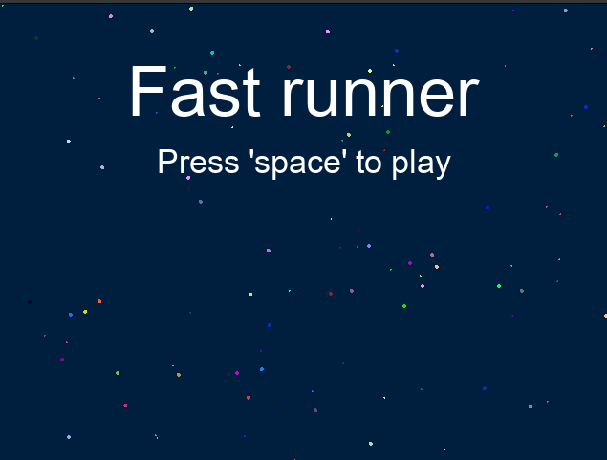
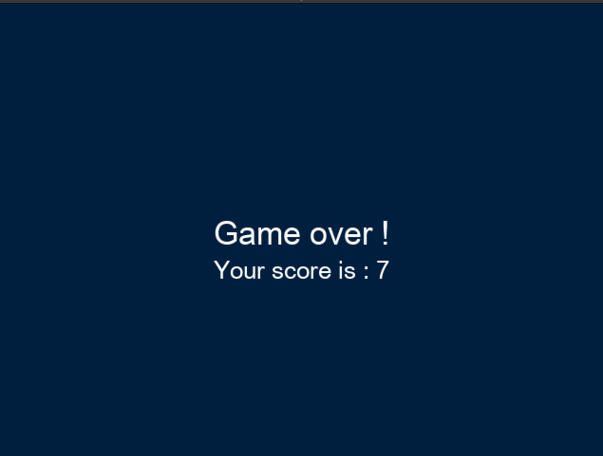

# Ruby2D Game

This project is a 2D game written with Ruby thanks to ruby2d gem.

## Objective

* Learn ruby2d
* Create a simple game
* Design a specific ship using Figma

## Description

In this game you can control a ship and have to cross space avoiding enemies incoming.

## Game images

Main screen:

Game screen :

Finished screen :

